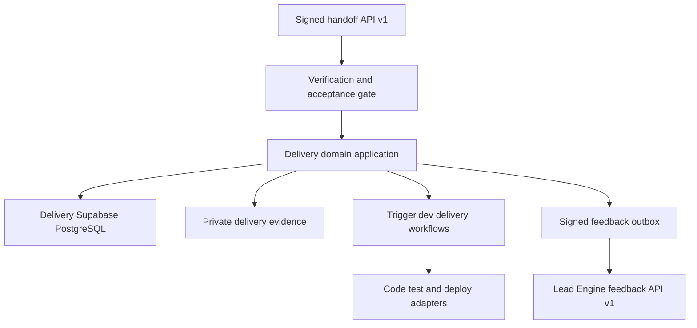
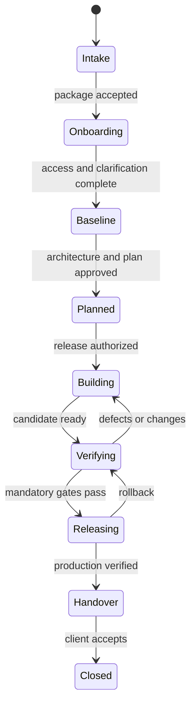

# Delivery Factory Technical Design Version 1

## Purpose and decision

This document defines the production architecture and delivery plan for the Raphah Delivery Factory. The Delivery Factory is an independently deployable product that accepts a verified Lead Engine handoff and converts the approved business baseline into a controlled client delivery project. It owns planning, architecture, implementation coordination, testing evidence, release readiness, handover, and post-delivery feedback.

The product will be delivered as a TypeScript modular monolith using Next.js App Router on Vercel and a dedicated Supabase project for PostgreSQL, Auth, and Storage. Durable orchestration uses Trigger.dev. Delivery automation may call code, testing, deployment, and AI providers through explicit adapters, but all client-impacting release decisions remain human-controlled.

The Delivery Factory has its own authentication application, database, storage, deployment, secrets, telemetry, audit history, backups, and incident response. It never reads the Lead Engine database. The only product integration is the versioned contract in `Platform_Integration_and_Operations_Design_v1.md`.

## 1 Scope and boundaries

### 1.1 Product responsibilities

The Delivery Factory will:

- receive, authenticate, verify, validate, accept, or reject a handoff package;
- create exactly one delivery project for an accepted package version;
- preserve the accepted package as an immutable source baseline;
- manage delivery discovery, clarifications, decisions, changes, risks, and dependencies;
- create architecture, backlog, milestones, test plans, release plans, and handover evidence;
- coordinate bounded build, test, preview, approval, production, and rollback workflows;
- maintain client-facing status and approval records;
- emit versioned feedback events to the Lead Engine;
- expose its own operational health, audit explorer, delivery metrics, and recovery controls.

The Delivery Factory will not:

- discover or qualify sales leads;
- modify an accepted Lead Engine package;
- use direct database access, shared tables, shared credentials, or Supabase foreign data links to integrate with the Lead Engine;
- release client-impacting changes solely on an AI or agent decision;
- treat generated code, tests, or deployment output as trusted without verification;
- assume that a successful deployment proves business acceptance.

### 1.2 Tenancy and roles

The Delivery Factory is multi-tenant by organization and project from its first production schema because it may include client stakeholders.

| Role                   | Scope and permissions                                                  |
| ---------------------- | ---------------------------------------------------------------------- |
| Delivery Administrator | Tenant setup, users, integrations, policies, audit export              |
| Delivery Lead          | Project governance, scope, plan, risk, release approval routing        |
| Business Analyst       | Clarifications, requirements, traceability, acceptance criteria        |
| Architect              | Technical decisions, architecture baseline, nonfunctional requirements |
| Engineer               | Implementation tasks, code evidence, remediation                       |
| Quality Reviewer       | Test plans, evidence review, readiness recommendation                  |
| Client Stakeholder     | Restricted project view, clarifications, decisions, acceptance         |
| Auditor                | Read-only project, evidence, audit, deployment and approval history    |

Membership is explicit at tenant and project level. Client users cannot see internal prompts, credentials, unrelated projects, operational secrets, or private engineering notes.

## 2 Architecture



### 2.1 Runtime components

| Component          | Responsibility                                                          | Technology                                              |
| ------------------ | ----------------------------------------------------------------------- | ------------------------------------------------------- |
| Web application    | Authenticated project UI, client views, route handlers                  | Next.js App Router, React, TypeScript                   |
| Acceptance gateway | Signature, freshness, replay, schema, checksum, and business validation | Next.js route handler plus shared contract package      |
| Domain layer       | Project states, baselines, changes, gates, approvals                    | TypeScript modules with Zod boundaries                  |
| System of record   | Tenant and project data, inbox/outbox, audit                            | Dedicated Supabase PostgreSQL                           |
| Evidence storage   | Plans, generated artifacts, test evidence, release and handover records | Dedicated private Supabase Storage                      |
| Workflow runtime   | Durable build, test, approval, deployment, feedback, recovery flows     | Trigger.dev                                             |
| Tool adapters      | Source control, sandbox, CI, deployment, notifications, AI              | Provider-specific adapters behind domain ports          |
| Observability      | Logs, traces, metrics, errors and delivery events                       | OpenTelemetry, Vercel Observability, Sentry integration |

### 2.2 Repository target

```text
apps/delivery-factory/             Next.js product
packages/delivery-domain/          projects, baselines, changes, gates
packages/delivery-db/              schema, migrations, repositories
packages/delivery-workflows/       Trigger.dev tasks and durable orchestration
packages/delivery-adapters/        source control, sandbox, CI and deploy ports
packages/handoff-contract/         shared public contract only
packages/audit/                    append-only audit primitives
packages/observability/            logging and tracing conventions
packages/ui/                       presentation primitives only
```

### 2.3 Dependency rules

- The acceptance gateway depends only on public contract types and Delivery Factory application services.
- Accepted package payloads are immutable and never mapped directly onto mutable project tables.
- Every derived requirement, task, test, decision, and release retains traceability to a baseline item or an approved change.
- Provider adapters cannot advance a project stage or approve a gate.
- Agents and models propose artifacts; deterministic validation and authorized people approve them.
- A deployment adapter cannot receive database credentials or client secrets that are not required for its specific action.
- Feedback events are created transactionally with the business change they report.

## 3 Authentication and authorization

The Delivery Factory uses a dedicated Supabase Auth application with a distinct JWT audience, cookies, redirect URLs, membership tables, and RLS policies. Identity may use the same upstream email or social provider as the Lead Engine, but the applications do not share sessions or authorization claims.

Authorization combines tenant membership, project membership, role, resource classification, project stage, and action. Middleware is only the first check; server application services and RLS make the authoritative decision. Service identities use narrowly scoped keys for handoff intake, workflow tasks, provider callbacks, and feedback delivery.

Sensitive actions require recent authentication and a reason: tenant role changes, package overrides, baseline approval, scope changes, production releases, rollback approval, client acceptance, exports, and retention operations.

## 4 Data architecture

### 4.1 Principal aggregates

| Aggregate         | Key records                                                          | Invariants                                                                        |
| ----------------- | -------------------------------------------------------------------- | --------------------------------------------------------------------------------- |
| Integration inbox | `handoff_inbox`, `handoff_receipt`, `replay_nonce`                   | Unique source, package, version; immutable raw payload; terminal receipt retained |
| Project           | `delivery_project`, `project_member`, `milestone`, `work_item`       | One project per accepted package version; stage changes are version checked       |
| Baseline          | `accepted_baseline`, `derived_requirement`, `trace_link`             | Accepted source immutable; derived changes never overwrite source                 |
| Architecture      | `architecture_decision`, `component`, `integration`, `environment`   | Decisions are versioned with status and consequences                              |
| Change control    | `clarification`, `change_request`, `impact_assessment`, `approval`   | Scope changes require impact and authorized disposition                           |
| Quality           | `test_plan`, `test_case`, `test_run`, `test_evidence`, `defect`      | Readiness derives from durable evidence, not only workflow status                 |
| Release           | `release_candidate`, `deployment`, `release_gate`, `rollback_record` | Production requires all mandatory gates and named approval                        |
| Handover          | `runbook`, `training_record`, `acceptance_record`, `warranty_item`   | Acceptance records actor, scope, date, and exceptions                             |
| Feedback          | `feedback_event`, `outbox_event`, `delivery_metric`                  | Events are idempotent, signed, and append-only                                    |
| Governance        | `audit_event`, `retention_job`, `integration_key`                    | Audit is insert-only; key material remains in secret storage                      |

### 4.2 Acceptance transaction

After transport authentication succeeds, the receiver stores the raw envelope and request metadata, checks replay controls, validates the schema and manifest, evaluates business acceptance, creates the receipt, and, if accepted, creates the project and accepted baseline in one database transaction. A repeated valid request returns the original receipt and project ID without creating another project.

### 4.3 Evidence storage

Private buckets separate handoff payloads, client-provided files, architecture artifacts, generated output, test evidence, releases, and handover packages. Every object stores a hash, classification, source, project, creator, tool or workflow version, and retention class. Client downloads use authorized short-lived signed URLs.

## 5 Delivery lifecycle



Every transition requires an expected version, authorized actor or service identity, satisfied guard conditions, reason, correlation ID, and audit event.

### 5.1 Intake and acceptance

The gateway performs these checks in order: content type and size, service authentication, timestamp freshness, nonce uniqueness, contract version, schema, canonical manifest, package status, required baseline content, supported capabilities, and tenant routing. Rejections return machine-readable reasons without creating a project.

### 5.2 Baseline and planning

The accepted package is displayed beside derived delivery records. Clarifications are sent back as feedback events. Answers and post-acceptance scope changes become project decisions or formal change requests. The Delivery Factory then produces an architecture baseline, milestones, work breakdown, test strategy, release approach, risk register, dependency map, and client decision schedule.

### 5.3 Controlled build and test workflows

Each automation run has an immutable run ID, workflow version, initiating actor, input artifact hashes, budget, permissions, attempt record, logs, outputs, and stop reason. Code execution occurs in an isolated sandbox with repository-scoped credentials and no production secrets. Generated changes are committed to a branch and reviewed through normal source-control protections.

Tests cover unit, integration, contract, browser, accessibility, security, migration, and recovery behavior as applicable. Evidence records exact code commit, environment, tool versions, result, logs, and artifact hashes. A model-authored test cannot be the sole evidence for the behavior it generated without independent execution.

### 5.4 Release and handover

Production release requires an approved release candidate, passing mandatory evidence, a migration and rollback plan, environment verification, client-impact assessment, and named release approval. Post-deployment verification confirms both technical health and agreed acceptance paths. Failure triggers rollback or feature disablement according to the approved plan.

Handover packages include the production inventory, configuration ownership, operating runbooks, backup and restore instructions, monitoring and alerts, known limitations, training evidence, support window, acceptance results, and outstanding items.

## 6 Application experience

| Area              | Essential screens                                                                    |
| ----------------- | ------------------------------------------------------------------------------------ |
| Home              | Delivery portfolio, intake queue, blocked work, release calendar, operational health |
| Handoff inbox     | Package comparison, verification evidence, accept or reject, receipt history         |
| Project workspace | Baseline, members, timeline, milestones, risks, dependencies, decisions              |
| Clarifications    | Questions, owners, due dates, source links, Lead Engine response status              |
| Requirements      | Accepted source, derived items, traceability, change requests, approvals             |
| Architecture      | Decisions, components, integrations, environments, diagrams, nonfunctional targets   |
| Build and test    | Runs, branches, artifacts, test evidence, defects, cost and retry history            |
| Release           | Candidate, gates, approvals, deployment, verification, rollback                      |
| Client portal     | Restricted status, decisions, evidence, approvals, training and acceptance           |
| Operations        | Workflows, providers, errors, inbox/outbox, usage, audit explorer, alerts            |

## 7 API design

The external product API is limited to the signed handoff and feedback protocol. Internal human-facing routes use authenticated server actions or `/api/v1` routes.

Initial internal resources:

- `GET /api/v1/handoff-inbox`
- `GET /api/v1/handoff-inbox/{receiptId}`
- `GET /api/v1/projects`
- `GET /api/v1/projects/{id}`
- `POST /api/v1/projects/{id}/stage-transitions`
- `GET|POST /api/v1/projects/{id}/clarifications`
- `GET|POST /api/v1/projects/{id}/change-requests`
- `GET|POST /api/v1/projects/{id}/architecture-decisions`
- `GET|POST /api/v1/projects/{id}/work-items`
- `GET|POST /api/v1/projects/{id}/test-runs`
- `GET|POST /api/v1/projects/{id}/release-candidates`
- `POST /api/v1/projects/{id}/release-approvals`
- `GET|POST /api/v1/projects/{id}/handover`
- `GET /api/v1/operations/runs`
- `GET /api/v1/audit-events`

Provider callbacks use separate routes, signatures, secrets, replay stores, size limits, and audit classifications. They never reuse the Lead Engine handoff identity.

## 8 Security and isolation

- Enforce tenant and project RLS on every business table and object path.
- Use least-privilege service identities for intake, workflows, source control, CI, deployment, and notifications.
- Keep generated code and uploaded files outside the application runtime until scanned and classified.
- Execute untrusted or generated code only in disposable sandboxes with egress controls, runtime limits, resource budgets, and no inherited production credentials.
- Protect production deployments with environment-specific roles, approval gates, protected branches, and separate deploy tokens.
- Validate callback origins and signatures; reject stale timestamps and repeated nonces.
- Redact secrets and sensitive client data from logs, traces, model prompts, and error responses.
- Maintain a dependency inventory, vulnerability scanning, secret scanning, and software bill of materials for releases.

## 9 Audit and observability

Every mutation writes an insert-only audit event containing tenant, project, actor, action, resource, before and after versions or hashes, reason, outcome, correlation ID, request ID, workflow run, deployment ID when relevant, and sanitized client context.

The minimum audited set includes package receipt, acceptance and rejection, membership changes, clarifications, baseline derivation, architecture decisions, scope changes, workflow starts and stops, agent permissions, code and test artifact creation, release gates, approvals, deployments, rollbacks, exports, client acceptance, retention, and key rotation.

Initial service objectives:

| Measure                           | Target                                                           |
| --------------------------------- | ---------------------------------------------------------------- |
| Authenticated UI availability     | 99.5 percent monthly                                             |
| Handoff acknowledgement p95       | Under 5 seconds excluding retry transport                        |
| Duplicate project creation        | Zero                                                             |
| Production release audit coverage | 100 percent                                                      |
| Mandatory test evidence retention | 100 percent for released candidates                              |
| Feedback enqueue durability       | No acknowledged project change without its required outbox event |

Alerts cover signature and replay failures, intake rejection spikes, tenant authorization failures, workflow exhaustion, stalled gates, deployment failures, rollback activation, feedback outbox age, storage failures, and unusual provider or model cost.

## 10 Deployment and environments

The Delivery Factory is a dedicated Vercel project rooted at `apps/delivery-factory` and mapped to `delivery.raphah.io`. It has independent local, preview/test, and production environments and its own Supabase projects or branches. No Lead Engine database URL, service role key, storage key, or browser session is present in its configuration.

Preview deployments can accept only test-signed packages from non-production Lead Engine environments. Production deployment requires migration, contract, RLS, end-to-end, security, sandbox isolation, provider callback, accessibility, backup restore, and rollback tests.

## 11 Test strategy

- Unit and property tests for state machines, permission decisions, canonicalization, gates, and idempotency.
- Contract tests for every supported handoff and feedback schema version.
- Database integration tests for tenant isolation, inbox uniqueness, immutable baselines, outbox atomicity, and audit controls.
- End-to-end tests from signed receipt through project creation, clarification, plan, test evidence, release approval, deployment record, and feedback.
- Security tests for forged signatures, stale timestamps, replayed nonces, cross-tenant access, malicious files, unsafe URLs, secret leakage, and sandbox escape controls.
- Failure tests for provider timeouts, partial workflow failure, duplicate callbacks, migration failure, deployment failure, and rollback.
- Browser and accessibility tests for internal and client roles.

## 12 Delivery plan

| Phase               | Outcome                                                      | Exit gate                                    |
| ------------------- | ------------------------------------------------------------ | -------------------------------------------- |
| 0 Foundation        | Architecture, contract, CI, environment and threat model     | Designs approved and prototype tests green   |
| 1 Product shell     | Next.js app, Supabase Auth, tenant and project RBAC, audit   | Protected preview and RLS suite pass         |
| 2 Intake            | Signed receiver, inbox, receipt, idempotent project creation | Contract, replay and transaction tests pass  |
| 3 Project workspace | Baseline, members, milestones, risk, dependencies, decisions | Accepted package is traceable and immutable  |
| 4 Planning          | Clarifications, derived requirements, architecture and plan  | Approval and change-control tests pass       |
| 5 Build workflows   | Sandboxed tool adapters, work items, branches and artifacts  | Permissions, budget and isolation tests pass |
| 6 Quality           | Test plans, runs, evidence, defects and readiness            | Mandatory evidence gates calculate correctly |
| 7 Release           | Candidates, approvals, deployment, verification and rollback | Staging release and rollback rehearsal pass  |
| 8 Handover          | Client portal, training, acceptance, feedback and operations | Production readiness review passes           |

## 13 Migration from the current prototype

The current `delivery-tool` package remains a behavior reference. First replace its hand-copied schema with `packages/handoff-contract`. Add an inbox repository and run the receiver tests against both the memory store and PostgreSQL. Introduce signature, timestamp, nonce, receipt, and transaction controls before exposing the route publicly. Then move project operations behind authenticated Next.js routes, add tenant RLS, and place long-running work in Trigger.dev. The Express server and in-memory store leave the production path only after acceptance and project tests pass against PostgreSQL.

## 14 Launch acceptance

The Delivery Factory is production-ready when it can authenticate and verify a versioned handoff, return a durable idempotent receipt, create one isolated project, preserve the source package, control changes through approvals, generate and independently verify delivery evidence, perform an approved release with rollback, complete client handover, and return signed feedback without any shared database or credential dependency on the Lead Engine.
