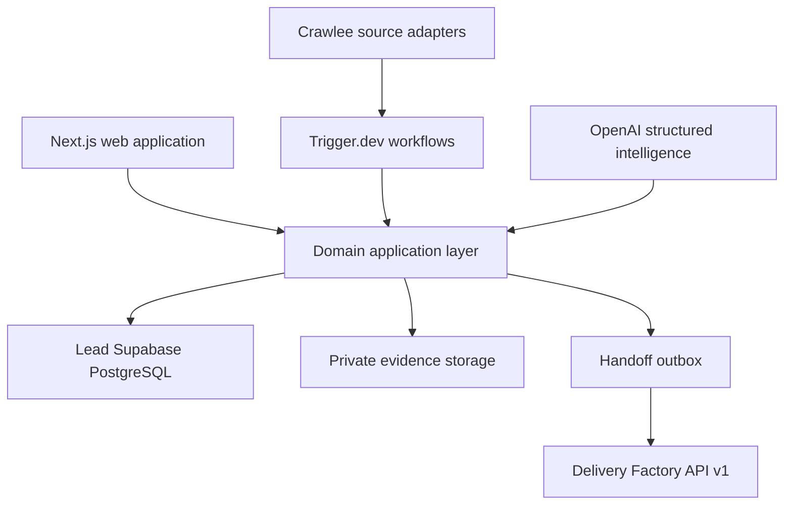

# Lead Engine Technical Design Version 2

## Purpose and decision

This document defines the production architecture and delivery plan for the Raphah Lead Engine. The Lead Engine is an independent, internal-first opportunity management product that owns the lifecycle from approved-source discovery through commercial qualification, client discovery, requirements baselining, and accepted handoff to the Delivery Factory.

The product will be delivered as a TypeScript modular monolith using Next.js App Router on Vercel, a dedicated Supabase project for PostgreSQL, Auth, and Storage, Trigger.dev for bounded workflows, Crawlee for approved public-web collection, and direct OpenAI Responses API calls with Zod-validated structured output. The product will have its own deployment, database, authentication application, secrets, telemetry, audit log, backups, and incident procedures.

This design supersedes the Lead Engine portions of `docs/runbooks/Lead_Engine_Technical_Design_Runbook.md`. The shared handoff protocol and cross-product operations are defined in `Platform_Integration_and_Operations_Design_v1.md`.

## 1 Scope and boundaries

### 1.1 Product responsibilities

The Lead Engine will:

- register and approve opportunity sources;
- collect evidence from approved APIs, feeds, sitemaps, public pages, public documents, manual URLs, email forwards, and CSV imports;
- treat LinkedIn as a manual or approved-interface channel only;
- normalize, deduplicate, score, and review opportunities;
- manage organizations, stakeholders, outreach drafts, activities, and commercial stages;
- capture client discovery and audit sessions against a lead ID;
- manage requirements, features, constraints, risks, decisions, and success measures;
- freeze an approved requirement baseline;
- create, approve, transmit, reconcile, and export immutable handoff packages;
- expose operational health, business metrics, audit history, and failure recovery controls.

The Lead Engine will not:

- scrape LinkedIn, automate LinkedIn login, bypass a CAPTCHA, or circumvent access controls;
- send outreach automatically in the MVP;
- generate, test, deploy, or operate client applications;
- read or write the Delivery Factory database;
- make AI-generated requirements authoritative without human validation;
- block normal lead work when the Delivery Factory is unavailable.

### 1.2 Users and roles

| Role          | Primary permissions                                                                |
| ------------- | ---------------------------------------------------------------------------------- |
| Owner         | Full workspace administration, policy approval, handoff release, audit export      |
| Administrator | User, role, source policy, retention, and integration administration               |
| Analyst       | Source review, opportunity qualification, organization research, discovery capture |
| Reviewer      | Approve opportunity, outreach draft, discovery record, and requirement baseline    |
| Auditor       | Read-only access to records, provenance, audit history, and operational evidence   |

The MVP is a single Raphah workspace, but every business row includes `workspace_id` and is protected by Row Level Security so future workspace separation does not require redesigning primary keys.

## 2 Architecture



### 2.1 Runtime components

| Component            | Responsibility                                                | Technology                                              |
| -------------------- | ------------------------------------------------------------- | ------------------------------------------------------- |
| Web application      | Authenticated UI, route handlers, server actions, read models | Next.js App Router, React, TypeScript                   |
| Domain layer         | State transitions, policies, approvals, package creation      | TypeScript modules with Zod boundaries                  |
| System of record     | Transactional business data, RLS, outbox, audit               | Dedicated Supabase PostgreSQL                           |
| Evidence storage     | Immutable source content and authorized attachments           | Dedicated private Supabase Storage buckets              |
| Workflow runtime     | Schedules, retries, budgets, human wait points                | Trigger.dev                                             |
| Collection adapters  | RSS, API, HTML, PDF, CSV, manual capture                      | Crawlee, Cheerio first, Playwright only when approved   |
| Intelligence adapter | Extraction, classification, summaries, draft assistance       | OpenAI Responses API with structured output             |
| Observability        | Logs, traces, metrics, errors, business events                | OpenTelemetry, Vercel Observability, Sentry integration |

### 2.2 Repository target

```text
apps/lead-engine/                 Next.js product
packages/lead-domain/             entities, policies, state machines
packages/lead-db/                 schema, migrations, repositories
packages/lead-workflows/          Trigger.dev tasks
packages/source-adapters/         approved collection adapters
packages/intelligence/            prompts, schemas, evaluations
packages/handoff-contract/        shared public contract only
packages/audit/                   append-only audit primitives
packages/observability/           logging and tracing conventions
packages/ui/                      presentation primitives only
```

Product-domain code must not be shared with the Delivery Factory. Only intentionally public schemas, audit plumbing, observability plumbing, and visual primitives may be shared.

### 2.3 Dependency rules

- UI code calls application services; it does not query database tables directly.
- Domain modules depend on interfaces, not Supabase, Trigger.dev, Vercel, or model-provider types.
- Collection cannot activate a source or change its policy.
- Intelligence cannot approve opportunities, send outreach, validate requirements, or release handoffs.
- Analytics consumes events and read models but cannot mutate operational state.
- Handoff creation reads one approved snapshot in a transaction and never exposes internal table structures.
- Delivery feedback is imported as an event and cannot rewrite an accepted package.

## 3 Authentication and authorization

The Lead Engine uses a dedicated Supabase Auth application. Its cookies, OAuth redirect URLs, JWT audience, signing configuration, and user memberships are not shared with the Delivery Factory.

Authorization is enforced in four places:

1. Next.js middleware performs coarse route protection.
2. Server routes resolve the authenticated user and active workspace.
3. Application services verify action-level permission and expected record state.
4. PostgreSQL RLS verifies workspace membership and blocks cross-workspace access.

Privileged service credentials are confined to server-only workflow functions. They are never exposed to browser bundles. Handoff release, policy approval, role changes, exports, and destructive retention actions require recent authentication and a recorded reason.

## 4 Data architecture

### 4.1 Principal aggregates

| Aggregate         | Key records                                                                | Invariants                                                                                    |
| ----------------- | -------------------------------------------------------------------------- | --------------------------------------------------------------------------------------------- |
| Source governance | `source`, `source_policy_version`, `crawl_run`                             | One active approved policy; bounded run; stop reason on non-success                           |
| Evidence          | `evidence_artifact`, `evidence_claim`, `artifact_link`                     | Immutable raw object; URL, retrieval time, parser version, hash, and policy decision retained |
| Opportunity       | `opportunity`, `score`, `risk_flag`, `duplicate_candidate`                 | Evidence required before approval; score components and weight version retained               |
| Relationship      | `organization`, `stakeholder`, `activity`, `outreach_draft`, `suppression` | Suppression blocks approval; external send remains human-controlled                           |
| Discovery         | `discovery_session`, `finding`, `decision`, `action_item`, `attachment`    | Approved version preserves participants, source notes, decisions, and provenance              |
| Requirements      | `requirement`, `feature_candidate`, `trace_link`, `baseline`               | Human validator required; Must items cannot freeze with blockers                              |
| Handoff           | `handoff_package`, `handoff_attempt`, `outbox_event`, `delivery_feedback`  | Released versions immutable; amendments reference accepted version                            |
| Governance        | `audit_event`, `retention_job`, `integration_key`                          | Audit is insert-only; secrets stored outside business tables                                  |

### 4.2 Required database controls

- UUID primary keys, `workspace_id`, `created_at`, `updated_at`, and optimistic `version` on mutable aggregates.
- Foreign keys and check constraints for all state transitions representable in the database.
- Partial unique index for one active source policy per source.
- Unique idempotency keys for commands, workflow attempts, outbox events, and handoff versions.
- Indexes for status plus update time, next scheduled run, normalized organization domain, opportunity fingerprint, and correlation ID.
- Append-only triggers or restricted grants for audit events and accepted handoff snapshots.
- Expand-and-contract migrations compatible with the immediately preceding application version.

### 4.3 Storage and retention

Evidence and discovery attachments use private buckets with object paths scoped by workspace and record ID. The application issues short-lived signed URLs after authorization. Object metadata stores content hash, MIME type, size, data class, source, and retention class.

Default retention policies are configurable by data class. Deletion creates an auditable tombstone, removes derived search content, and schedules object deletion. Accepted handoff packages and their approval history follow the contractual retention period and are never silently mutated.

## 5 Core workflows

### 5.1 Source and collection loop

1. An analyst registers a source and its business purpose.
2. An owner or administrator records terms, robots behavior, allowed paths, fields, schedule, budgets, retention, and stop conditions.
3. Approval activates a versioned policy.
4. Trigger.dev starts a bounded collection run using the approved policy version.
5. Crawlee prefers API, feed, sitemap, and static HTTP; browser rendering requires explicit approval.
6. A denial, CAPTCHA, authentication wall, unapproved redirect, or policy mismatch stops the run and creates an audit event.
7. The system stores immutable evidence before extraction and records run cost and outcome.

### 5.2 Opportunity loop

`captured -> triage -> qualified -> engaged -> discovery -> solution_fit -> commercial -> handoff_ready -> handed_off`

`disqualified`, `lost`, and `archived` are terminal business outcomes. State changes require expected-version checks and a reason. Risk flags remain separate from the 0-100 score and can block advancement.

### 5.3 Discovery and requirement loop

Each discovery or audit meeting is created inside the opportunity workspace. The user records agenda, participants, current processes, systems, data, problems, constraints, decisions, open questions, actions, and authorized attachments. AI may propose a summary, requirement, feature, risk, or question, but each suggestion remains non-authoritative until accepted or edited by a named human.

Requirements trace back to source notes or approved evidence. A baseline cannot freeze while a Must requirement lacks a source, validator, acceptance criteria, or documented exception, or while it has an unresolved blocking question. Features included in handoff must trace to validated requirements.

### 5.4 Handoff loop

The Lead Engine freezes a complete approved snapshot, calculates the canonical SHA-256 manifest, records the approver, writes the immutable package and outbox event in one transaction, and returns immediately. A worker signs and transmits the package through the versioned API. Failures remain visible in the outbox and do not block local work. An authorized user can export the same signed package for manual transfer.

## 6 Application experience

| Area            | Essential screens                                                                           |
| --------------- | ------------------------------------------------------------------------------------------- |
| Home            | Pipeline health, priority review queue, next actions, source health, handoff status         |
| Sources         | Registry, policy versions, approval, run history, stop reasons, fixtures                    |
| Opportunities   | Search, filters, score explanation, risks, duplicates, evidence                             |
| Lead workspace  | Organization, stakeholders, timeline, outreach, discovery, requirements, commercial scope   |
| Meeting capture | Structured live notes, evidence links, AI suggestions, validation queue, decisions, actions |
| Requirements    | Traceability matrix, conflicts, blockers, baseline comparison, approval                     |
| Handoffs        | Readiness check, package preview, approval, attempts, receipt, amendments, manual export    |
| Operations      | Workflow runs, outbox, errors, usage, cost, audit explorer, integration health              |
| Administration  | Users, roles, retention, secrets status, provider settings, feature flags                   |

Every operational failure view must provide a correlation ID, plain-language cause, safe next action, and an audit trail link.

## 7 API design

Human-facing commands use authenticated server actions or `/api/v1` route handlers with a common envelope containing `commandId`, `workspaceId`, `actorId`, `idempotencyKey`, `expectedVersion`, `requestedAt`, and typed payload.

Initial resource routes:

- `GET|POST /api/v1/sources`
- `POST /api/v1/sources/{id}/policy-approval`
- `POST /api/v1/sources/{id}/runs`
- `GET|POST /api/v1/opportunities`
- `GET /api/v1/opportunities/{id}/workspace`
- `POST /api/v1/opportunities/{id}/stage-transitions`
- `GET|POST /api/v1/opportunities/{id}/discovery-sessions`
- `GET|POST /api/v1/opportunities/{id}/requirements`
- `POST /api/v1/opportunities/{id}/baselines`
- `POST /api/v1/opportunities/{id}/handoffs`
- `POST /api/v1/handoffs/{id}/release`
- `GET /api/v1/operations/runs`
- `GET /api/v1/audit-events`

The Delivery Factory does not call these business routes. Product-to-product traffic uses only the contract described in the integration design.

## 8 Security and compliance

- Deny by default for routes, RLS, storage, source paths, and outbound destinations.
- Enforce CSRF protection, secure same-site cookies, strict content security policy, trusted origins, and request-size limits.
- Validate outbound URLs against approved hostnames and block private, loopback, link-local, metadata, and non-HTTP destinations.
- Encrypt traffic and provider-managed data at rest; rotate secrets and service keys on a documented schedule.
- Minimize personal data, record lawful/business purpose, and support access, correction, export, retention, and deletion workflows.
- Log security-relevant decisions without logging tokens, full message bodies, raw sensitive evidence, or model prompts containing client material.
- Maintain CASL readiness records for consent basis, sender identity, unsubscribe requirements, and suppression status.

## 9 Audit and observability

### 9.1 Audit event

Each state mutation emits an insert-only audit event with event ID, workspace, timestamp, actor type and ID, action, resource type and ID, prior and resulting version or hashes, reason, outcome, correlation ID, request ID, and sanitized client context. Corrections are new events.

High-value audited actions include authentication changes, role changes, source policy decisions, collection stops, AI suggestion validation, opportunity approval, outreach approval, requirement validation, baseline freeze, handoff release/export, retention actions, and integration-key rotation.

### 9.2 Operational telemetry

Structured JSON logs and OpenTelemetry spans carry `service`, `environment`, `deployment_id`, `trace_id`, `correlation_id`, `workspace_id`, `workflow_run_id`, and safe resource identifiers. Vercel provides runtime and deployment telemetry; Sentry receives handled and unhandled errors; business metrics are derived from durable events.

Initial service objectives:

| Measure                       | Target                                                    |
| ----------------------------- | --------------------------------------------------------- |
| Authenticated UI availability | 99.5 percent monthly                                      |
| Normal read request p95       | Under 800 ms excluding third-party calls                  |
| Command acknowledgement p95   | Under 1.5 seconds for non-workflow commands               |
| Scheduled run start delay p95 | Under 5 minutes                                           |
| Audit event coverage          | 100 percent of privileged and state-changing actions      |
| Handoff enqueue durability    | No acknowledged release without package and outbox record |

Alerts cover elevated error rate, repeated authorization denials, stopped source runs, workflow retry exhaustion, outbox age, signature failures, storage errors, and unusual model cost.

## 10 Deployment and environments

The Lead Engine is a dedicated Vercel project rooted at `apps/lead-engine` and mapped to `lead.raphah.io`. Preview deployments use isolated preview configuration and a non-production Supabase project or branch. Production secrets exist only in the Lead Engine project.

Required environments are local, preview/test, and production. Production deployment requires passing contract, migration, security, accessibility, end-to-end, and build checks; an approved database migration plan; and a verified rollback. Scheduled and long-running work executes in Trigger.dev, not inside request handlers.

## 11 Test strategy

The release gate includes:

- unit tests for policies, scoring, state machines, canonicalization, and requirement quality;
- property tests for idempotency and package canonicalization;
- database integration tests including RLS and append-only controls;
- source-adapter fixture tests with policy, redirect, denial, and size-limit cases;
- AI schema, provenance, regression, and cost evaluations;
- API contract tests against the shared handoff package;
- end-to-end tests for source approval, opportunity review, meeting capture, baseline freeze, release, and retry;
- security tests for authorization, workspace isolation, SSRF controls, signed URLs, and secret leakage;
- accessibility and browser tests for the core workspace.

No release may weaken the rule that an unapproved source cannot run, an AI suggestion cannot self-approve, a suppressed recipient cannot be approved for outreach, or an accepted handoff cannot mutate.

## 12 Delivery plan

| Phase             | Outcome                                                                        | Exit gate                                        |
| ----------------- | ------------------------------------------------------------------------------ | ------------------------------------------------ |
| 0 Foundation      | Monorepo target, architecture records, shared contract, CI and environment map | Designs approved and current tests green         |
| 1 Product shell   | Next.js app, Supabase Auth, workspace RBAC, navigation, audit foundation       | Protected preview and RLS tests pass             |
| 2 Persistent core | PostgreSQL repositories for sources, evidence, opportunities, activities       | In-memory store removed from production path     |
| 3 Collection      | Source policies, Trigger.dev runs, bounded adapters, evidence storage          | Policy and stop-condition tests pass             |
| 4 Lead workspace  | Organization, stakeholders, timeline, outreach and pipeline                    | One lead lifecycle works end to end              |
| 5 Discovery       | Meeting capture, AI suggestion review, decisions and actions                   | Approved session retains full provenance         |
| 6 Requirements    | Traceability, validation, baseline comparison and freeze                       | Must-quality gates and concurrency tests pass    |
| 7 Handoff         | Signed package, outbox, receipt, manual export and amendments                  | Delivery contract suite and outage recovery pass |
| 8 Operations      | Dashboards, alerts, retention, backup restore and incident runbooks            | Production readiness review passes               |

## 13 Migration from the current prototype

The current `lead-engine` package remains a behavior reference while modules move behind repository and service interfaces. First extract the duplicated handoff schema into `packages/handoff-contract`. Next introduce a PostgreSQL repository alongside the memory store and run the existing domain tests against both. Then place the application services behind Next.js route handlers, add Supabase Auth and RLS, and move crawl and delivery retries to Trigger.dev. Remove permissive CORS and the production in-memory path only after end-to-end parity is demonstrated.

## 14 Launch acceptance

The Lead Engine is ready for production use when a permitted source can be approved, collected, reviewed, converted into an opportunity, progressed through an auditable discovery meeting, expressed as validated requirements and features, frozen into an approved baseline, and handed to the Delivery Factory without direct database access. The full lifecycle must survive duplicate requests and downstream unavailability, expose operational evidence, and preserve every human approval.
