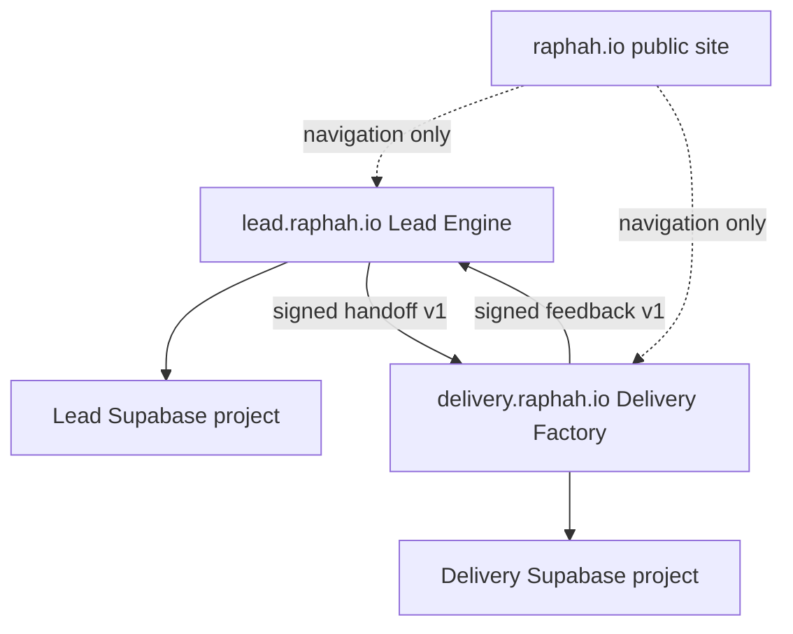
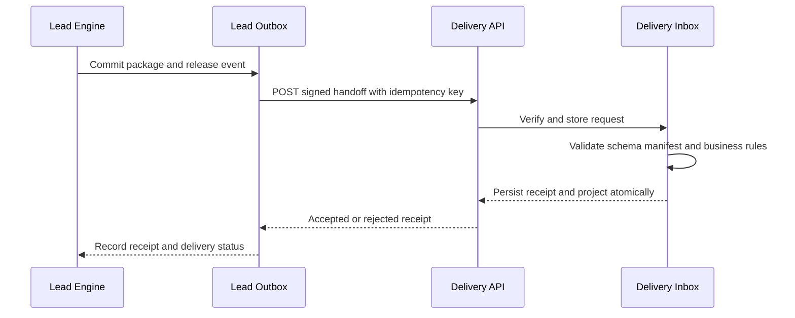

# Platform Integration and Operations Design Version 1

## Purpose and decision

This document defines the only supported integration between the Raphah Lead Engine and Delivery Factory and the shared operating model for their independent deployments. The products remain operationally separate. They communicate through versioned, signed, idempotent API messages and optional authorized package export. They do not share databases, sessions, credentials, storage buckets, queues, or provider-specific domain types.

The initial public contract is `LeadEngineHandoffPackage` version `1.0.0`, received at `POST /api/v1/handoffs`. Delivery feedback uses `DeliveryFeedbackEvent` version `1.0.0`, received at `POST /api/v1/delivery-feedback`. Both directions use a transactional outbox, durable inbox, Ed25519-signed service JWT, SHA-256 canonical payload manifest, timestamp freshness, nonce replay protection, correlation IDs, and idempotent receipts.

## 1 System topology and ownership



| Capability           | Lead Engine owner                 | Delivery Factory owner                | Shared artifact                           |
| -------------------- | --------------------------------- | ------------------------------------- | ----------------------------------------- |
| Human authentication | Dedicated Lead Auth               | Dedicated Delivery Auth               | None                                      |
| Authorization        | Lead workspace RBAC and RLS       | Delivery tenant/project RBAC and RLS  | Role vocabulary may be documented only    |
| Operational data     | Lead PostgreSQL                   | Delivery PostgreSQL                   | Versioned message schemas                 |
| Files                | Lead private buckets              | Delivery private buckets              | Hashes and authorized transfer references |
| Deployments          | Lead Vercel project               | Delivery Vercel project               | CI conventions                            |
| Background work      | Lead Trigger.dev project          | Delivery Trigger.dev project          | Workflow envelope conventions             |
| Audit and telemetry  | Lead-owned records and dashboards | Delivery-owned records and dashboards | Correlation field names                   |
| Incident response    | Lead service runbooks             | Delivery service runbooks             | Cross-product integration playbook        |

## 2 Trust boundaries

1. Browser users authenticate only to the product they are using.
2. Product-to-product requests use service identities, never forwarded browser access tokens.
3. Each receiver treats the other product as an external caller and validates every message.
4. A network success is not business acceptance; only a persisted receipt is authoritative.
5. A valid signature does not replace schema, integrity, authorization, and business validation.
6. A recipient outage cannot block the sender's local product work.
7. An accepted payload is immutable. Corrections use a new package version or amendment.

## 3 Shared contract package

The repository contains `packages/handoff-contract`, a dependency-free TypeScript package containing Zod schemas, inferred types, canonical JSON helpers, manifest verification, header constants, error codes, example fixtures, and compatibility tests. It contains no database client, HTTP client, auth provider, business service, or product-specific repository.

The package publishes explicit entry points:

```text
@raphah/handoff-contract/handoff/v1
@raphah/handoff-contract/feedback/v1
@raphah/handoff-contract/security
@raphah/handoff-contract/canonical-json
@raphah/handoff-contract/testing
```

Semantic versioning applies to the package, while each payload also carries its schema version. A package release can add a new schema without removing older supported schemas.

### 3.1 Handoff envelope

```json
{
  "eventId": "uuid",
  "eventType": "lead.handoff.released",
  "schemaVersion": "1.0.0",
  "occurredAt": "ISO-8601",
  "producer": "lead-engine",
  "environment": "production",
  "correlationId": "uuid",
  "package": {},
  "manifest": {
    "algorithm": "sha256",
    "payloadHash": "64 lowercase hex characters",
    "attachments": []
  }
}
```

The package includes organization context, stakeholders, problem statement, current state, approved requirement baseline, traced features, constraints, risks and assumptions, success measures, commercial scope, supporting-artifact metadata, open items, source versions, approver, and approval time. Personal and sensitive data is minimized to what Delivery needs.

### 3.2 Feedback envelope

Feedback event types initially include:

- `delivery.handoff.accepted`
- `delivery.handoff.rejected`
- `delivery.clarification.requested`
- `delivery.project.started`
- `delivery.scope.change.requested`
- `delivery.release.completed`
- `delivery.project.closed`

Each event includes event ID, schema version, occurrence time, producer, environment, correlation ID, package ID and version, project ID when assigned, typed details, and manifest. Feedback is append-only and cannot mutate the accepted Lead Engine package.

## 4 Transport security

### 4.1 Service identity

Each sender signs a short-lived JWT using Ed25519. The token includes issuer, audience, subject, environment, scopes, issued time, expiry, and unique token ID. The receiver verifies it against the sender's allowlisted JWKS and rejects an unexpected issuer, audience, algorithm, scope, environment, expiry, or key ID.

Initial scopes are:

- `handoff:create` for Lead Engine to Delivery Factory;
- `feedback:create` for Delivery Factory to Lead Engine.

Keys are environment-specific. Rotation publishes the next public key before the sender changes signing keys and retains the previous verification key only for the documented overlap window.

### 4.2 Request controls

Required headers:

| Header               | Purpose                            |
| -------------------- | ---------------------------------- |
| `Authorization`      | Bearer service JWT                 |
| `Content-Type`       | `application/json` only            |
| `Idempotency-Key`    | Stable key for the logical message |
| `X-Raphah-Timestamp` | Signed request creation time       |
| `X-Raphah-Nonce`     | Unique random replay token         |
| `X-Correlation-ID`   | Cross-product trace identifier     |
| `X-Content-SHA256`   | Hash of exact request bytes        |

The receiver limits request size, reads raw bytes once, verifies the content hash, verifies the service token, enforces a five-minute timestamp window, inserts the nonce under a unique constraint, and only then parses JSON. Failed authentication and replay attempts are audited with safe metadata.

### 4.3 Payload integrity

The manifest hash is SHA-256 over RFC 8785-style canonical JSON for the contract-defined payload excluding the manifest itself. Attachment entries contain logical ID, media type, byte length, SHA-256 hash, classification, and either an embedded transfer object or an authorized reference. The receiver verifies every transferred attachment before acceptance.

## 5 Handoff protocol



### 5.1 Endpoint

`POST /api/v1/handoffs`

Success means the receiver durably stored a terminal receipt. Responses:

- `201 Created` when a new package version is accepted and creates a project;
- `200 OK` for an idempotent replay of a previously terminal request;
- `400 Bad Request` for malformed JSON or schema failure;
- `401 Unauthorized` for invalid service authentication;
- `403 Forbidden` for valid identity without required scope or environment;
- `409 Conflict` for package-version conflict or reused idempotency key with different content;
- `422 Unprocessable Entity` for business rejection;
- `429 Too Many Requests` with `Retry-After`;
- `503 Service Unavailable` for a retryable receiver dependency failure.

### 5.2 Receipt

```json
{
  "receiptId": "uuid",
  "status": "accepted",
  "packageId": "uuid",
  "packageVersion": 1,
  "projectId": "uuid",
  "receivedAt": "ISO-8601",
  "correlationId": "uuid",
  "rejectionReasons": []
}
```

Rejection reasons are arrays of `{ code, message, path, retryable }`. Messages contain no stack traces or secrets.

### 5.3 State model

Lead-side package states are `draft`, `validated`, `approved`, `queued`, `transmitting`, `accepted`, `rejected`, and `superseded`. `failed` is an attempt outcome, not a package terminal state. Delivery-side inbox states are `received`, `verified`, `accepted`, and `rejected`.

The sender marks a package accepted only from a verified receipt matching package ID, version, content hash, environment, and correlation lineage.

## 6 Idempotency, replay, and ordering

- The logical handoff idempotency key is `handoff:{packageId}:{packageVersion}`.
- The logical feedback key is `feedback:{eventId}`.
- The receiver stores the key, content hash, terminal response, and expiry under a unique constraint.
- Repeating a key with the same hash returns the original receipt.
- Repeating a key with a different hash returns `409` and a security audit event.
- Nonces are unique per issuer and environment for at least the maximum token lifetime plus clock skew.
- Consumers order package changes by package ID and version, not network arrival time.
- A newer package does not silently replace an accepted package; it is an amendment referencing the accepted version.

## 7 Transactional inbox and outbox

Each sender writes the business state change and outbox event in one database transaction. A worker claims pending events using database locking, sends them, and records attempt metadata. Each receiver stores the inbox message, terminal receipt, and any accepted business aggregate in one transaction.

Retry uses exponential backoff with jitter and a maximum attempt and age budget. Retry only applies to timeouts, connection failures, `429`, and `5xx` responses marked retryable. Schema, signature, checksum, replay, and business rejections do not retry automatically. Exhausted events remain visible for authorized replay after the cause is corrected.

## 8 Error taxonomy and reconciliation

| Class               | Examples                                  | Automatic action                 | Human action                          |
| ------------------- | ----------------------------------------- | -------------------------------- | ------------------------------------- |
| Transport           | DNS, timeout, connection reset            | Retry within budget              | Investigate if age alert fires        |
| Throttle            | `429`, provider limit                     | Honor `Retry-After`              | Adjust capacity or schedule           |
| Authentication      | Invalid issuer, key, token, scope         | Stop; no retry                   | Verify configuration or rotate key    |
| Replay or conflict  | Reused nonce, mismatched idempotency hash | Stop; security audit             | Investigate caller and payload        |
| Schema              | Unsupported version, missing field        | Stop                             | Correct producer or add compatibility |
| Integrity           | Content or manifest mismatch              | Stop; security alert             | Compare canonicalization and transfer |
| Business            | Missing baseline, unsupported capability  | Stop; structured rejection       | Amend and release a new version       |
| Receiver dependency | Database or storage unavailable           | Retry if receiver says retryable | Follow service incident runbook       |

An hourly reconciliation job compares old pending outbox events, terminal receipts, accepted package versions, project IDs, and feedback checkpoints. It never infers acceptance from a missing response. Authorized operators may request receipt status by idempotency key and manually replay an unchanged event.

## 9 Versioning and compatibility

- Patch changes clarify validation or add non-semantic metadata without changing accepted documents.
- Minor schema changes add optional fields or new enum values with tolerant-reader rules.
- Major changes remove, rename, reinterpret, or require fields.
- Producers send only versions advertised as supported by the target environment.
- Receivers support the current major version and the immediately preceding major version during an announced migration window.
- Consumer-driven contract tests run in both product pipelines before merge.
- Breaking changes require an architecture decision record, migration plan, dual-read or dual-send period, rollback plan, and retirement date.

## 10 Environment and deployment model

| Product          | Vercel project            | Domain               | Data and Auth                                          |
| ---------------- | ------------------------- | -------------------- | ------------------------------------------------------ |
| Public site      | `raphah-site`             | `raphah.io`          | Public-site resources only                             |
| Lead Engine      | `raphah-lead-engine`      | `lead.raphah.io`     | Dedicated Supabase project and Trigger.dev environment |
| Delivery Factory | `raphah-delivery-factory` | `delivery.raphah.io` | Dedicated Supabase project and Trigger.dev environment |

One GitHub monorepo may contain all three applications, but Vercel projects have different roots, environment variables, domains, service identities, and deployment histories. Path-aware CI builds only affected products while a root contract job always runs when `packages/handoff-contract` changes.

Preview products communicate only with matching non-production identities and data. Production URLs, keys, service-role credentials, and client secrets are never available to preview builds.

## 11 CI and release gates

Every affected product runs formatting, lint, type checks, unit tests, architecture-boundary tests, database migration tests, RLS tests, contract tests, security scans, production build, and preview end-to-end checks. Contract fixtures include valid packages, every rejection category, old supported versions, unknown future fields, duplicate delivery, nonce replay, modified content, and receipt replay.

The deployment order for a compatible contract extension is receiver first, producer second. A breaking migration uses parallel schema versions and a defined rollback checkpoint. Database migrations use expand-and-contract sequencing.

## 12 Independent observability

Each product owns its telemetry project and dashboards. Cross-product correlation uses shared field names but never a shared audit table.

Required context fields are `service`, `environment`, `deployment_id`, `trace_id`, `correlation_id`, `request_id`, `event_id`, `package_id`, `package_version`, `workflow_run_id`, and safe tenant or workspace identifiers. Sensitive payloads, service tokens, personal contact content, client documents, and raw prompts are not logged.

Shared integration dashboards show only replicated operational facts: attempts, latency, status class, rejection code, receipt ID, package ID and version, project ID, and correlation ID. The source of truth remains each product's database and audit log.

Initial integration alerts:

- oldest pending handoff exceeds 15 minutes;
- oldest pending feedback exceeds 30 minutes;
- signature, environment, replay, or checksum failures occur;
- rejection rate exceeds the agreed threshold;
- sender and receiver receipt counts diverge;
- unsupported contract version is attempted;
- reconciliation finds accepted package without mapped project or recorded Lead receipt.

## 13 Audit and evidence

Both products record send, receive, verification, validation, receipt, retry, replay, manual export/import, reconciliation, key rotation, and operator replay events. Audit records carry compatible event names and correlation fields, but remain stored and retained independently.

For a disputed handoff, the minimum evidence set is the immutable sender package, manifest, approval event, outbox attempts, request metadata, receiver raw content hash, verification result, terminal receipt, project mapping, related feedback events, deployment IDs, and key IDs. Private signing keys and raw access tokens are never evidence artifacts.

## 14 Availability and disaster recovery

The products degrade independently. If Delivery is unavailable, Lead records and retries the handoff while all local lead functions remain available. If Lead is unavailable, Delivery continues active projects and queues feedback. Authorized manual export and import provide a controlled contingency path using the identical schema, manifest, signature, and receipt process.

Each product maintains its own backup schedule and quarterly restore rehearsal. Target recovery objectives for the MVP are RPO of 24 hours for general operational data, near-zero loss for committed handoff and release records through transactional persistence, and RTO of 8 business hours. These targets must be revised before contractual service commitments.

## 15 Integration incident runbook

1. Identify the affected direction, environments, time window, deployment IDs, and correlation IDs.
2. Pause only the failing dispatcher or contract version; keep local product functions available.
3. Classify the failure using the taxonomy and preserve logs, receipts, payload hashes, and audit events.
4. Confirm whether any terminal receipt exists before retrying.
5. For authentication or integrity failures, rotate or correct configuration before resuming; do not blind-retry.
6. Reconcile package IDs, versions, hashes, receipts, and project mappings.
7. Replay unchanged events only through the authorized operator action.
8. Record resolution, affected records, data correction, preventive change, and follow-up owner.

## 16 Delivery sequence

| Increment | Deliverable                                                           | Acceptance                                    |
| --------- | --------------------------------------------------------------------- | --------------------------------------------- |
| 1         | Shared schemas, canonical JSON, checksum, fixtures and contract tests | Both prototypes consume one package           |
| 2         | Service JWT, JWKS, timestamp, nonce and content-hash middleware       | Forgery, expiry and replay tests pass         |
| 3         | Lead outbox and Delivery inbox with durable receipts                  | Duplicate and outage tests pass on PostgreSQL |
| 4         | Delivery feedback outbox and Lead feedback inbox                      | Clarification and project-status loop closes  |
| 5         | Separate Vercel, Supabase and Trigger.dev environments                | Preview-to-preview smoke test passes          |
| 6         | Correlated telemetry, reconciliation, alerting and operator controls  | Failure drill and manual replay pass          |
| 7         | Production domains, key rotation and disaster-recovery rehearsal      | Production readiness review passes            |

## 17 Governance decisions

Architecture decision records are required for changes to product ownership, authentication provider, database separation, contract security, supported schema versions, signature algorithm, retention, autonomous release authority, external communication, or deployment topology. The default remains strict product independence with contract-only integration.

## 18 Platform launch acceptance

The platform boundary is ready when independent Lead and Delivery deployments can authenticate each other, transfer a complete immutable handoff, return a durable idempotent receipt, correlate the transaction across separate telemetry systems, queue safely through outages, reject forged or altered requests, recover through reconciliation or authorized manual transfer, and evolve the schema through tested version rules without shared database, session, credential, or runtime dependencies.
