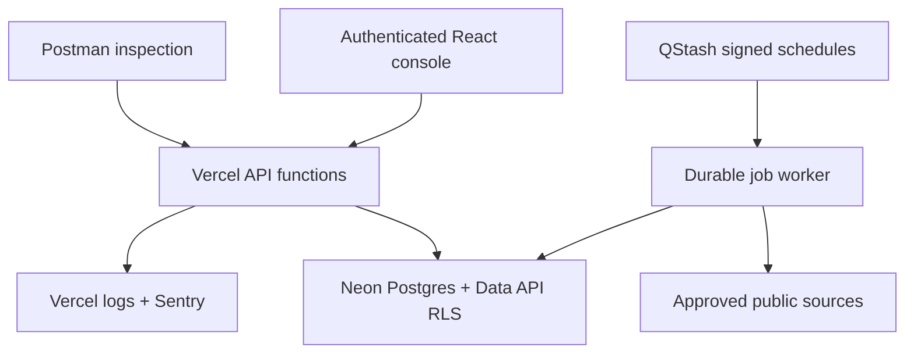

# Lead Engine Production Readiness Runbook

## Purpose

This runbook moves Lead Engine v3 from a buildable release candidate to a production-approved service on Vercel Hobby, Neon Free, and Upstash QStash Free. Passing local tests is necessary but does not replace the database isolation test, live collection test, or 72-hour canary.

## Verified checkpoint — 2026-09-23

**Status: implementation in progress; do not promote.** These changes are local and have not been deployed.

- Lead Engine typecheck and Vite production build pass.
- Lead Engine unit/regression tests: 24 pass, including manual scheduler authorization and unsigned-request rejection. Earlier domain-only coverage was 99.42% statements, 94.33% branches, 93.75% functions. This is not backend-wide integration coverage.
- Existing shared-contract and legacy Lead/Delivery service tests: 16 pass.
- The complete monorepo typecheck and build pass. Recharts and `input-otp` React type-compatibility failures in the mockup package were corrected, and the root test gate now includes the production Lead Engine suite.
- Neon v3 migration, a genuine-token Data API/RLS harness, and job-lifecycle SQL assertions are prepared but **not executed**. Neon and QStash have not yet been provisioned.
- `VERCEL_TOKEN` authentication and access to `d-raphah`, `d-raphah-leads-engine`, and `d-raphah-delivery-factory` were verified through the Vercel REST API using IPv4. The OAuth connector remains incorrectly scoped to an inaccessible team, so it is not accepted as deployment evidence. No environment mutation or production telemetry review has been performed.
- No 72-hour soak, persistent restart experiment, concurrent database integration test, or live Postman lifecycle has passed yet.

### Implemented hardening awaiting integration validation

- Source approval cannot be bypassed with direct authenticated table writes. Worker RPCs are server-role-only.
- Manual job replay preserves completed state and rejects a different request using the same key.
- Claim transactions serialize source selection; attempts start atomically under an owned lease. Worker invocation IDs are unique.
- Evidence, signals, organization, assessment, lead refresh, attempt completion, canary completion, and job completion commit in one lease-fenced Neon transaction. Raw evidence is content-addressed and capped at 250 KB in Postgres; extracted text is capped at 100 KB. Refresh does not reset commercial stage/status.
- Named-city criteria narrow region targeting. Radius calculations require unambiguous structured coordinates; missing coordinates fail closed. Named-place matching remains a heuristic, not a verified address.
- Weekly recommendations count distinct organizations per campaign and exclude canaries. Recommendations are volume-based and human-applied; outcome-quality calibration is not implemented yet.
- Canary evaluation requires 72 elapsed hourly slots, counts missing slots against completion, and rejects duplicate-only and future-completed evidence. At hourly cadence, one failed slot out of 72 is below 99%.
- The local mirror is versioned, actor-checked, and non-authoritative, following the React review guidance.

### Remaining implementation gates

1. Complete permitted-source business discovery beyond a single target URL: directory/feed result expansion, per-business identity attribution, bounded crawl depth, and durable child jobs. Fetching an RSS/sitemap document is not equivalent to discovering each business in it.
2. Enforce source budgets and request pacing across workers, strengthen robots handling, and pin validated DNS addresses (or use an approved egress proxy) to close DNS-rebinding risk. Current DNS prechecks alone are not a complete SSRF defence.
3. Complete industry/company-size evidence and feedback-quality calibration; the current ICP contribution is a fixed baseline. Maturity scores are heuristic indices, not measured percentages of AI use.
4. Restore discovery sessions, validated requirements/features, immutable baseline release, and durable signed handoff in the new authenticated UI/data plane. Legacy in-memory services and their passing tests do not establish this production parity. Delivery Factory persistence/authentication and signed receipt handling remain independent work.
5. Add paginated full lead export, job/evidence drill-down UI, retention/orphan cleanup, and high-volume operational aggregation. Current list limits must not be treated as complete exports or scale proof.
6. Run actual database concurrency, restart, tenant isolation, retry/DLQ and full-pipeline tests against a disposable Neon branch before production. Verify QStash dispatch latency and free-tier message/storage budgets against the start-latency target.

These are code and integration gates, not merely missing credentials. A working Neon/QStash/Vercel connection does not by itself make this release production-ready.

## Architecture



The job queue, attempts, leases, evidence metadata, signals, assessments, opportunities, and audit events are PostgreSQL records. A browser or worker restart therefore cannot erase work. The frontend's local storage contains only a last-known read mirror.

## Release gates

| Gate               | Verification                                                  | Required result                                            |
| ------------------ | ------------------------------------------------------------- | ---------------------------------------------------------- |
| Build integrity    | Typecheck, Vitest, Vite build                                 | All pass                                                   |
| Policy enforcement | Create source, try job before and after approval              | Pre-approval blocked; approved public source runs          |
| Full pipeline      | Source → evidence → signals → score → lead                    | Evidence and assessment persisted; qualifying lead appears |
| Restart durability | Queue job, interrupt worker, invoke next tick                 | Job remains and resumes/retries                            |
| Lease recovery     | Expire a leased fixture, invoke tick                          | Requeued or dead-lettered by attempt count                 |
| Idempotency        | Submit same `Idempotency-Key` twice                           | One job and one lead per workspace/organization            |
| RLS                | Run `pnpm test:rls:neon` with two genuine Auth tokens         | Isolation, denial, audit, worker-RPC denial pass           |
| Job transactions   | Run `job_lifecycle_v3.sql` and concurrent/restart experiments | Replay, lease ownership, expiry and durability verified    |
| Audit              | Mutate source, campaign, job, feedback                        | Trigger-generated audit event for each persisted mutation  |
| Retry/DLQ          | Use a controlled transient failure, then a permanent failure  | Backoff retry and manual DLQ recovery demonstrated         |
| Canary             | Hourly controlled scrape for 72 hours                         | At least 72 runs and completion `>=99%`                    |
| Scheduler SLO      | `/api/v1/operations`                                          | Start p95 `<300,000 ms`                                    |
| Telemetry          | Vercel errors plus Sentry release                             | No material unhandled runtime error                        |
| API inspection     | Postman production collection                                 | Auth, job lifecycle, SSE, audit, leads, SLO requests pass  |

## Provision Neon and QStash

1. In the personal Vercel Hobby scope, attach Neon and Upstash QStash Marketplace integrations to the Lead Engine project. Do not create a Vercel Team.
2. Enable Neon Auth and Data API, then apply `apps/leads-engine/neon/migrations/202609220001_lead_engine_production.sql` to a disposable branch.
3. Run `job_lifecycle_v3.sql` on that branch and `pnpm test:rls:neon` using two real Neon Auth sessions. Apply the migration to production only after both pass.
4. Set `LEAD_ENGINE_BASE_URL` and `QSTASH_TOKEN`, then run `pnpm qstash:configure`. Stable schedule IDs make the command safely repeatable.
5. Confirm QStash shows the five-minute worker schedule and hourly canary schedule, with signed delivery and three retries.

## Configure Vercel

Set these variables on the **Lead Engine project only**:

- `VITE_NEON_AUTH_URL`
- `VITE_NEON_DATA_API_URL`
- `NEON_AUTH_URL`
- `NEON_DATA_API_URL`
- `DATABASE_URL` (sensitive, server-only)
- `QSTASH_TOKEN`, `QSTASH_CURRENT_SIGNING_KEY`, `QSTASH_NEXT_SIGNING_KEY` (sensitive, server-only)
- `HANDOFF_SIGNING_PRIVATE_KEY_PEM`, `HANDOFF_SIGNING_PUBLIC_KEY_PEM` (sensitive, server-only; Ed25519 key pair for signing handoff packages)
- `DELIVERY_INTAKE_URL` (Delivery Factory intake endpoint; when unset, signed handoffs queue in the outbox until it is set)
- `WORKER_SECRET` (optional sensitive key for Postman/manual diagnostics)
- `SENTRY_DSN` and `SENTRY_ENVIRONMENT=production`
- `LEAD_ENGINE_ORIGIN=https://d-raphah-leads-engine.vercel.app`

After the first approved canary source exists, add:

- `LEAD_ENGINE_CANARY_URL`
- `LEAD_ENGINE_CANARY_WORKSPACE_ID`
- `LEAD_ENGINE_CANARY_SOURCE_ID`

Redeploy after environment changes. Verify `/api/health/live` first. `/api/health/ready` intentionally returns `503` until the database is migrated and a worker heartbeat exists.

## Liveness and full-pipeline test

1. Create an operator account in the UI.
2. Register a public page controlled by Raphah. Use static HTML that contains deterministic manual-process and commercial-urgency phrases.
3. Confirm a job cannot be queued while the policy is pending.
4. Approve the policy as an owner/administrator.
5. Queue the target with a fixed `Idempotency-Key` in Postman.
6. Wait for the signed QStash tick or invoke the worker tick with the optional bearer `WORKER_SECRET` from Postman.
7. Inspect the job until it reaches `completed`.
8. Confirm: capped raw evidence, evidence row, signal rows, versioned maturity assessment, one organization, and—when thresholds are met—one opportunity.
9. Resubmit the same key and confirm the job and opportunity counts do not increase.

## Retry, dead letter, and lease recovery

- **Transient fixture:** return HTTP 429 or 503. Confirm `retrying`, a future `next_attempt_at`, and increasing attempt history.
- **Permanent fixture:** use a robots-denied path or unsupported policy method. Confirm `dead_letter` without uncontrolled retry.
- **Manual recovery:** correct the fixture, call `/api/v1/scrape-jobs/{id}/retry`, and confirm completion.
- **Expired lease:** in the test database set a leased job's `lease_expires_at` to the past, run the worker tick, and confirm `recover_expired_scrape_leases` moves it to `retrying` or `dead_letter`.

## 72-hour canary

The hourly QStash schedule inserts one canary and one scrape job per workspace/source/UTC hour with conflict-ignore semantics. Replays never reset existing results. Do not backfill missing hours to manufacture a pass. Include a configured location and sufficient manual-process evidence in the controlled fixture; a fetch without a qualified persistent lead is a failed canary.

Monitor:

- `/api/health/canary`
- `/api/v1/operations`
- Vercel runtime error clusters and function logs
- Sentry issues for the deployed release

Promotion is allowed only when `canary.passed=true`, completion is at least `0.99`, at least 72 hourly observations exist, and `jobs.scheduledStartTargetMet=true`.

## Rollback

1. Pause all campaigns (`schedule_enabled=false`).
2. Roll back the Vercel production deployment to the last known-good build.
3. Do not reverse a migration that would delete evidence, jobs, audit events, or assessments.
4. Apply a forward-fix migration for schema defects.
5. Preserve failed jobs and audit history for the incident review.

## Production decision

The release status remains **NOT PRODUCTION READY** until the remaining implementation gates, Neon/QStash provisioning, RLS execution, live pipeline evidence, Postman lifecycle execution, Vercel/Sentry review, and the 72-hour canary all pass. Do not replace the deployed UI with this unfinished parity implementation.

## Delivery feedback loop (Delivery Factory -> Lead Engine)

Delivery lifecycle events (`delivery.handoff.accepted`, `delivery.clarification.requested`,
`delivery.release.completed`, `delivery.project.closed`, ...) are enqueued in the Delivery
Factory's `feedback_outbox` and dispatched to the Lead Engine machine route
`POST /api/v1/feedback/events`. Authentication is Ed25519, the mirror image of handoff
signing: the factory signs `{ event, nonce, issuedAt }`; the Lead Engine verifies with the
factory's public key. The two products share no database and no credentials.

Set these variables on the **Delivery Factory project only**:

- `FEEDBACK_SIGNING_PRIVATE_KEY_PEM` (sensitive, server-only; factory Ed25519 private key)
- `LEAD_ENGINE_BASE_URL` (e.g. `https://d-raphah-leads-engine.vercel.app`)
- `DELIVERY_FACTORY_CRON_SECRET` (sensitive; bearer secret for the internal dispatch endpoint)

Set this variable on the **Lead Engine project only**:

- `DELIVERY_FACTORY_PUBLIC_KEY_PEM` (the factory public key below, `\n` escapes for single-line values)

```
-----BEGIN PUBLIC KEY-----\nMCowBQYDK2VwAyEAqly1hebw+Xoguep3B4/Yr3OFvGOG0CIa/05Tl4sfikI=\n-----END PUBLIC KEY-----\n
```

Create the dispatcher schedule once the QStash credential is valid:

```
qstash schedule create \
  --cron "*/5 * * * *" \
  --header "Authorization: Bearer $DELIVERY_FACTORY_CRON_SECRET" \
  https://<delivery-factory-app>/api/internal/dispatch-feedback
```

The dispatcher claims due rows with `FOR UPDATE SKIP LOCKED`, posts signed envelopes with a
15s timeout, and applies exponential backoff with jitter (6h cap, 10 attempts). Terminal
client errors (400/401/409/422) fail the row immediately; 5xx/429/network errors reschedule.
Event inserts on the Lead Engine are idempotent on the contract's `eventId`, so a retried
dispatch after a lost response is acknowledged as a duplicate, not stored twice.
